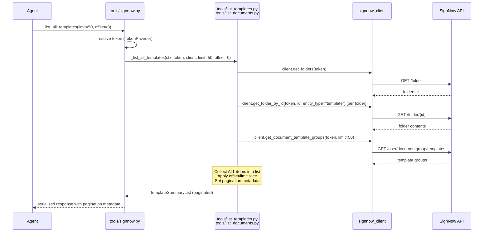

# Spec: Pagination for List Endpoints

## 1. Business Goal & Value

Claude's MCP Directory requires **token-efficient responses (max 25,000 tokens per tool result)**. The two list endpoints — `list_all_templates` and `list_documents` — currently return _all_ items in a single response. For accounts with hundreds of templates or documents, this can exceed the 25k-token limit (~75,000–100,000 useful characters of JSON). Adding `limit`/`offset` pagination ensures responses stay within budget while giving agents a predictable way to page through large collections.

### Philosophy Check ✅

| Principle | Verdict | Rationale |
|-----------|---------|-----------|
| Thin Translator | ✅ | Pagination is transport-level slicing, not business logic. The server still translates faithfully — just in bounded chunks. |
| Stateless | ✅ | `offset`/`limit` is fully stateless (no cursors, no server-side page tokens). Each request is self-contained. |
| Tool Minimization | ✅ | No new tools. Two existing tools gain two optional parameters each. |
| Token Efficiency | ✅ | This is the primary motivation. Prevents oversized responses that violate Claude's 25k-token limit. |
| YAGNI | ✅ | Directly required by Claude MCP Directory submission requirements. Not speculative. |
| No Infrastructure Coupling | ✅ | Pure Python slicing. No external pagination service, no database cursors. |

---

## 2. Affected Layers

| Layer | File(s) | Change Type | Description |
|-------|---------|-------------|-------------|
| Tool Response Models | `tools/models.py` | Modified | Add pagination metadata fields to `TemplateSummaryList` and `SimplifiedDocumentGroupsResponse` |
| Tool Business Logic | `tools/list_templates.py` | Modified | Accept `limit`/`offset`, slice after full collection |
| Tool Business Logic | `tools/list_documents.py` | Modified | Accept `limit`/`offset`, slice after full collection |
| Tool Orchestrator | `tools/signnow.py` | Modified | Add `limit`/`offset` params to `list_all_templates` and `list_documents` (tool + resource) |
| Tests | `tests/unit/sn_mcp_server/tools/test_list_templates.py` | Modified | Add pagination test cases |
| Tests | `tests/unit/sn_mcp_server/tools/test_list_documents.py` | New | Pagination tests for document listing |
| Documentation | `README.md` | Modified | Document pagination parameters for list tools |

---

## 3. System Diagram (Mermaid)



---

## 4. Technical Architecture

### 4.1. Pydantic Models (Response Models — `tools/models.py`)

#### 4.1.1 `TemplateSummaryList` — Add Pagination Metadata

```python
class TemplateSummaryList(BaseModel):
    """List of simplified template summaries with pagination."""

    templates: list[TemplateSummary]
    total_count: int = Field(..., description="Total number of templates across all pages")
    offset: int = Field(0, description="Number of items skipped")
    limit: int = Field(50, description="Maximum number of items in this page")
    has_more: bool = Field(False, description="Whether more items exist beyond this page")
```

#### 4.1.2 `SimplifiedDocumentGroupsResponse` — Add Pagination Metadata

```python
class SimplifiedDocumentGroupsResponse(BaseModel):
    """Simplified response for MCP tools with document groups and pagination."""

    document_groups: list[SimplifiedDocumentGroup]
    document_group_total_count: int = Field(..., description="Total number of document groups across all pages")
    offset: int = Field(0, description="Number of items skipped")
    limit: int = Field(50, description="Maximum number of items in this page")
    has_more: bool = Field(False, description="Whether more items exist beyond this page")
```

No new API-level models needed in `signnow_client/models/` — pagination is applied after fetch, not delegated to SignNow API.

### 4.2. Function Signatures

#### 4.2.1 Business Logic — `tools/list_templates.py`

```python
async def _list_all_templates(
    ctx: Context,
    token: str,
    client: SignNowAPIClient,
    limit: int = 50,
    offset: int = 0,
) -> TemplateSummaryList:
    """Get all templates and template groups from all folders, with pagination.

    Fetches the complete list from SignNow API, then applies offset/limit slicing.

    Args:
        ctx: FastMCP context object
        token: Access token for SignNow API
        client: SignNow API client instance
        limit: Maximum number of items to return (1–100, default 50)
        offset: Number of items to skip (default 0)

    Returns:
        TemplateSummaryList with paginated results and metadata
    """
    ...
```

#### 4.2.2 Business Logic — `tools/list_documents.py`

```python
async def _list_document_groups(
    ctx: Context,
    token: str,
    client: SignNowAPIClient,
    filter: str | None = None,
    sortby: str | None = None,
    order: str | None = None,
    folder_id: str | None = None,
    expired_filter: str = "all",
    limit: int = 50,
    offset: int = 0,
) -> SimplifiedDocumentGroupsResponse:
    """Provide simplified list of document groups with basic fields, with pagination.

    Fetches the complete list from SignNow API, then applies offset/limit slicing.

    Args:
        ctx: FastMCP context object
        token: Access token for SignNow API
        client: SignNow API client
        filter: signing-status filter value (optional)
        sortby: Sort field (optional)
        order: Sort order (optional, requires sortby)
        folder_id: Filter by folder ID (optional)
        expired_filter: Filter by invite expiredness (optional, default: all)
        limit: Maximum number of items to return (1–100, default 50)
        offset: Number of items to skip (default 0)

    Returns:
        SimplifiedDocumentGroupsResponse with paginated results and metadata
    """
    ...
```

#### 4.2.3 Tool Orchestrator — `tools/signnow.py` (Signatures Only)

For `list_all_templates` tool and `list_all_templates_resource`:

```python
async def list_all_templates(
    ctx: Context,
    limit: Annotated[
        int,
        Field(ge=1, le=100, description="Maximum number of items to return (1-100, default 50)"),
    ] = 50,
    offset: Annotated[
        int,
        Field(ge=0, description="Number of items to skip for pagination (default 0)"),
    ] = 0,
) -> TemplateSummaryList:
    ...
```

For `list_documents` tool and `list_documents_resource`:

```python
async def list_documents(
    ctx: Context,
    filter: ... = None,     # existing param
    sortby: ... = None,     # existing param
    order: ... = None,      # existing param
    folder_id: ... = None,  # existing param
    expired_filter: ... = "all",  # existing param
    limit: Annotated[
        int,
        Field(ge=1, le=100, description="Maximum number of items to return (1-100, default 50)"),
    ] = 50,
    offset: Annotated[
        int,
        Field(ge=0, description="Number of items to skip for pagination (default 0)"),
    ] = 0,
) -> SimplifiedDocumentGroupsResponse:
    ...
```

### 4.3. Business Logic Flow

Both endpoints follow an identical pagination pattern — "fetch all, then slice":

#### `_list_all_templates` (modified flow)

1. Fetch all folders via `client.get_folders(token)`
2. Iterate root + subfolders, collect `TemplateSummary` items from each folder (existing logic, unchanged)
3. Fetch template groups via `client.get_document_template_groups(token, limit=50)`, add to same list (existing logic, unchanged)
4. **NEW: Capture `total_count = len(all_templates)`**
5. **NEW: Slice — `page = all_templates[offset : offset + limit]`**
6. **NEW: Compute `has_more = (offset + limit) < total_count`**
7. Return `TemplateSummaryList(templates=page, total_count=total_count, offset=offset, limit=limit, has_more=has_more)`

#### `_list_document_groups` (modified flow)

1. Fetch all folders via `client.get_folders(token, entity_type="all")` (existing)
2. Iterate folder entries, collect `SimplifiedDocumentGroup` items (existing logic with filter/sort/expired, unchanged)
3. **NEW: Capture `total_count = len(simplified_groups)`**
4. **NEW: Slice — `page = simplified_groups[offset : offset + limit]`**
5. **NEW: Compute `has_more = (offset + limit) < total_count`**
6. Return `SimplifiedDocumentGroupsResponse(document_groups=page, document_group_total_count=total_count, offset=offset, limit=limit, has_more=has_more)`

### 4.4. Default Limit Justification

**Token budget:** 25,000 tokens ≈ 75,000–100,000 characters of JSON.

**Per-item size estimates (serialized JSON):**

| Model | Avg chars/item | Notes |
|-------|---------------|-------|
| `TemplateSummary` | ~300–400 | 7 fields, short strings, small roles list |
| `SimplifiedDocumentGroup` | ~800–1,500 | Nested invite with participants, nested documents list |

**Capacity at limit=50:**

| Endpoint | Items × Avg Size | Total chars | Token estimate | Within budget? |
|----------|-------------------|-------------|----------------|----------------|
| Templates | 50 × 350 | ~17,500 | ~5,000 | ✅ Very safe |
| Documents | 50 × 1,200 | ~60,000 | ~17,000 | ✅ Safe |

**Capacity at limit=100 (worst case):**

| Endpoint | Items × Avg Size | Total chars | Token estimate | Within budget? |
|----------|-------------------|-------------|----------------|----------------|
| Templates | 100 × 400 | ~40,000 | ~11,000 | ✅ Safe |
| Documents | 100 × 1,500 | ~150,000 | ~42,000 | ❌ Risky for complex groups |

**Conclusion:** Default `limit=50` is safe for both endpoints. Max `limit=100` is safe for templates, potentially risky for documents with many participants — but acceptable as an explicit agent choice. The `ge=1, le=100` constraint prevents abuse.

### 4.5. Error Catalog

| # | Trigger | Exception Class | Message Template |
|---|---------|----------------|------------------|
| 1 | `limit < 1` or `limit > 100` | Pydantic `ValidationError` | Automatic from `Field(ge=1, le=100)` — e.g., `"Input should be greater than or equal to 1"` |
| 2 | `offset < 0` | Pydantic `ValidationError` | Automatic from `Field(ge=0)` — e.g., `"Input should be greater than or equal to 0"` |
| 3 | `offset >= total_count` | _Not an error_ | Returns empty `templates`/`document_groups` list with correct `total_count` and `has_more=false`. This is standard REST pagination behavior. |
| 4 | No access token | `ValueError` | `"No access token available"` (existing, unchanged) |
| 5 | SignNow API error during folder fetch | `SignNowAPIError` subclass | Existing error handling, unchanged. |

No new exception classes needed. Pagination validation is handled entirely by Pydantic `Field` constraints at the tool parameter level.

---

## 5. Implementation Steps

- [ ] **Step 1:** Modify `TemplateSummaryList` in `tools/models.py` — add `offset`, `limit`, `has_more` fields
- [ ] **Step 2:** Modify `SimplifiedDocumentGroupsResponse` in `tools/models.py` — add `offset`, `limit`, `has_more` fields
- [ ] **Step 3:** Modify `_list_all_templates()` in `tools/list_templates.py` — add `limit`/`offset` params, apply slice + metadata at end
- [ ] **Step 4:** Modify `_list_document_groups()` in `tools/list_documents.py` — add `limit`/`offset` params, apply slice + metadata at end
- [ ] **Step 5:** Modify `list_all_templates` tool + resource in `tools/signnow.py` — add `limit`/`offset` annotated params, pass through to `_list_all_templates_impl`
- [ ] **Step 6:** Modify `list_documents` tool + resource in `tools/signnow.py` — add `limit`/`offset` annotated params, pass through to `_list_documents_impl`
- [ ] **Step 7:** Update existing tests in `test_list_templates.py` to account for new response fields
- [ ] **Step 8:** Add new pagination test cases to `test_list_templates.py` (offset, limit, has_more, empty page)
- [ ] **Step 9:** Create `test_list_documents.py` with pagination test cases (or add to existing test file if one exists)
- [ ] **Step 10:** Update `README.md` Tools section — document `limit`/`offset` params for both list tools

---

## 6. Test Matrix

### 6.1 `_list_all_templates` Pagination Tests

| # | Test Name | Input | Mocked API Behavior | Expected Output / Assertion |
|---|-----------|-------|--------------------|-----------------------------|
| 1 | `test_list_templates_default_pagination` | no limit/offset | Returns 5 templates | `total_count=5, offset=0, limit=50, has_more=False`, all 5 in `templates` |
| 2 | `test_list_templates_with_limit` | `limit=2` | Returns 5 templates | `total_count=5, offset=0, limit=2, has_more=True`, 2 items in `templates` |
| 3 | `test_list_templates_with_offset` | `offset=3, limit=50` | Returns 5 templates | `total_count=5, offset=3, limit=50, has_more=False`, 2 items in `templates` |
| 4 | `test_list_templates_offset_beyond_total` | `offset=100, limit=50` | Returns 5 templates | `total_count=5, offset=100, limit=50, has_more=False`, 0 items in `templates` |
| 5 | `test_list_templates_limit_and_offset` | `offset=1, limit=2` | Returns 5 templates | `total_count=5, offset=1, limit=2, has_more=True`, 2 items (index 1 and 2) |
| 6 | `test_list_templates_exact_page_boundary` | `offset=3, limit=2` | Returns 5 templates | `total_count=5, offset=3, limit=2, has_more=False`, 2 items (index 3 and 4) |
| 7 | `test_list_templates_empty_result` | `limit=50` | Returns 0 templates | `total_count=0, offset=0, limit=50, has_more=False`, 0 items |

### 6.2 `_list_document_groups` Pagination Tests

| # | Test Name | Input | Mocked API Behavior | Expected Output / Assertion |
|---|-----------|-------|--------------------|-----------------------------|
| 1 | `test_list_documents_default_pagination` | no limit/offset | Returns 3 doc groups | `document_group_total_count=3, offset=0, limit=50, has_more=False`, all 3 |
| 2 | `test_list_documents_with_limit` | `limit=2` | Returns 5 doc groups | `document_group_total_count=5, offset=0, limit=2, has_more=True`, 2 items |
| 3 | `test_list_documents_with_offset` | `offset=3, limit=50` | Returns 5 doc groups | `document_group_total_count=5, offset=3, limit=50, has_more=False`, 2 items |
| 4 | `test_list_documents_offset_beyond_total` | `offset=100` | Returns 5 doc groups | `document_group_total_count=5, has_more=False`, 0 items |
| 5 | `test_list_documents_pagination_with_filters` | `filter="pending", limit=2` | Returns 4 pending groups | `document_group_total_count=4, limit=2, has_more=True`, 2 items |
| 6 | `test_list_documents_pagination_with_expired_filter` | `expired_filter="expired", limit=1` | Returns 3 total, 2 expired | `document_group_total_count=2, limit=1, has_more=True`, 1 expired item |

---

## 7. Risk Assessment

| Risk | Impact | Likelihood | Mitigation |
|------|--------|------------|------------|
| **Breaking existing integrations** — agents that don't pass `limit`/`offset` get different response shape | Low | Low | Default values (`limit=50`, `offset=0`) preserve existing behavior for small collections. New fields (`offset`, `limit`, `has_more`) are additive — they don't remove or rename existing fields. `total_count` / `document_group_total_count` semantics change from "items in response" to "items in full collection" — but these were already named `total_count`, so this is arguably a bug fix. |
| **Large accounts still timeout** — fetching ALL items from folders before slicing could be slow for accounts with thousands of documents | Medium | Medium | This is a pre-existing issue unrelated to pagination. Pagination doesn't make it worse. A future optimization could add server-side pagination to the folder API calls, but that's YAGNI until measured. |
| **Token limit still exceeded at `limit=100`** — document groups with many participants could produce >25k tokens at max limit | Low | Low | Default of 50 is safe. Agents choosing `limit=100` accept the risk. The `le=100` constraint prevents extreme values. Could add a future `compact` response mode, but YAGNI. |
| **`total_count` semantic change** — `TemplateSummaryList.total_count` and `SimplifiedDocumentGroupsResponse.document_group_total_count` currently equal `len(items)`, now they'll equal total count pre-slice | Medium | Low | This is actually a correction — the field name implies total count, not page count. Agents using `total_count` to validate response completeness will now get the correct total. |

---

## 8. File Structure Summary

```plaintext
src/
├── sn_mcp_server/
│   └── tools/
│       ├── models.py               ← MODIFIED (add offset, limit, has_more to 2 response models)
│       ├── list_templates.py       ← MODIFIED (add limit/offset params, slice logic)
│       ├── list_documents.py       ← MODIFIED (add limit/offset params, slice logic)
│       └── signnow.py              ← MODIFIED (add limit/offset params to 2 tools + 2 resources)
tests/
└── unit/
    └── sn_mcp_server/
        └── tools/
            ├── test_list_templates.py  ← MODIFIED (update existing + add pagination tests)
            └── test_list_documents.py  ← NEW (pagination tests for document listing)
README.md                               ← MODIFIED (document pagination params)
```
