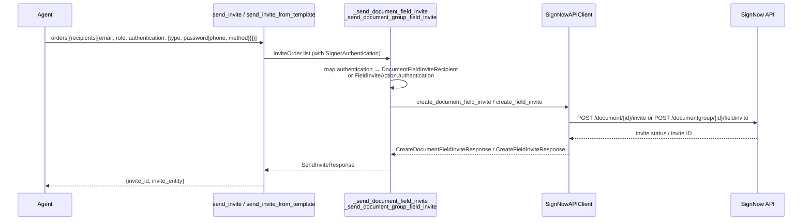

# Spec: SN-30607 — Signer Authentication for Field Invites

**Ticket:** [SN-30607](https://pdffiller.atlassian.net/browse/SN-30607)  
**Type:** Story — In Progress  
**Status:** Spec draft

---

## 1. Business Goal & Value

The `send_invite` and `send_invite_from_template` MCP tools currently accept per-recipient signer details but expose no authentication parameters, so every invite is sent with zero identity verification. SignNow's field invite API already supports two authentication methods — **password** (signer must enter a pre-set secret phrase) and **phone** (signer receives a one-time code via SMS or phone call). This story extends the `InviteRecipient` model to accept optional, per-signer authentication settings and threads them through both invite paths (document and document_group). No changes are needed in `signnow_client/` because the API-level models (`DocumentFieldInviteRecipient`, `FieldInviteAction`) already carry the relevant fields.

### Philosophy Check

| Principle | Verdict | Rationale |
|-----------|---------|-----------|
| Thin Translator | ✅ | Maps tool-level auth params → existing API fields; no new state or cache. |
| Stateless | ✅ | No session state; auth config lives in the request. |
| Tool Minimization | ✅ | Extends `InviteRecipient` in-place — no new MCP tools needed. |
| Token Efficiency | ✅ | Runtime payload overhead is zero unless user asks (field is `None` by default). Schema overhead is a constant baseline cost shared across all tool invocations regardless of this story. |
| YAGNI | ✅ | Both auth methods are explicitly requested in acceptance criteria. |
| No Infrastructure Coupling | ✅ | Pure business-logic change; no env vars, no transport coupling. |

---

## 2. Affected Layers

| Layer | File(s) | Change Type | Description |
|-------|---------|-------------|-------------|
| Tool Models | `src/sn_mcp_server/tools/models.py` | Add + Modify | New `SignerAuthentication` model; add `authentication` field to `InviteRecipient` |
| Tool Logic | `src/sn_mcp_server/tools/send_invite.py` | Modify | Propagate `recipient.authentication` to both document and document_group invite paths |
| API Models | `src/signnow_client/models/templates_and_documents.py` | No change | `DocumentFieldInviteRecipient` and `FieldInviteAction` already have the necessary fields. Note: `DocumentFieldInviteAuthentication` (lines 464–473) is a separate unused nested model in the same file — it is **not** used for the document path, which accepts flat fields directly on the recipient. Its removal is deferred to a cleanup task; the implementing developer should add an inline comment: `# Unused — document path uses flat fields on DocumentFieldInviteRecipient; scheduled for cleanup`. |
| Tests — Unit | `tests/unit/sn_mcp_server/tools/test_send_invite.py` | Add | Happy paths and error paths for auth variants |
| Tests — Integration | `tests/integration/test_send_invite.py` | Add | Tool → client contract for auth variants |

---

## 3. System Diagram



---

## 4. Technical Architecture

### 4.1 Pydantic Models

```python
# src/sn_mcp_server/tools/models.py  — NEW model, insert near InviteRecipient
# Imports to add: from pydantic import model_validator

class SignerAuthentication(BaseModel):
    """Optional signer identity verification settings.

    Use ONLY when the user explicitly requests authentication for a signer.
    Do NOT proactively suggest or apply this. Omitting it sends the invite
    with no authentication (the default SignNow behaviour).
    """

    type: Literal["password", "phone"] = Field(
        ...,
        description=(
            "Authentication method: 'password' — signer must enter a pre-set secret phrase; "
            "'phone' — signer receives a one-time code via SMS or phone call."
        ),
    )
    password: str | None = Field(
        None,
        description="Secret phrase the signer must enter. Required when type='password'.",
    )
    phone: str | None = Field(
        None,
        description="Signer's phone number (E.164 recommended). Required when type='phone'.",
    )
    method: Literal["sms", "phone_call"] | None = Field(
        default=None,
        description=(
            "Delivery method for the one-time code. Used only when type='phone'. "
            "Defaults to 'sms' on the SignNow backend when not specified. "
            "Omit for password auth — this field has no effect in that context."
        ),
    )
    sms_message: str | None = Field(
        None,
        description=(
            "Custom SMS message body (max 140 chars). "
            "Use '{password}' placeholder where the code should be inserted. "
            "Used only when type='phone' and method='sms'."
        ),
        max_length=140,
    )

    @model_validator(mode="before")
    @classmethod
    def _strip_irrelevant_credential(cls, data: Any) -> Any:
        """Remove the irrelevant credential from the raw input dict before Pydantic
        captures it for ValidationError.input_value.

        Prevents password from appearing in error output when type='phone' (and vice versa).
        Runs before field assignment, so the raw dict captured by Pydantic for error
        reporting never contains both type='phone' and a password value simultaneously.
        """
        if isinstance(data, dict):
            auth_type = data.get("type")
            if auth_type == "phone":
                data = {k: v for k, v in data.items() if k != "password"}
            elif auth_type == "password":
                data = {k: v for k, v in data.items() if k not in ("phone", "method", "sms_message")}
        return data

    @model_validator(mode="after")
    def _validate_required_credentials(self) -> "SignerAuthentication":
        """Enforce that the credential matching the selected type is present."""
        if self.type == "password" and not (self.password or "").strip():
            raise ValueError("password is required when authentication type is 'password'")
        if self.type == "phone" and not (self.phone or "").strip():
            raise ValueError("phone is required when authentication type is 'phone'")
        return self

    def __repr__(self) -> str:
        """Mask password in repr to prevent secret leakage in logs and error messages."""
        masked_password = _mask_secret_value(self.password) if self.password else None
        return (
            f"SignerAuthentication(type={self.type!r}, password={masked_password!r}, "
            f"phone={self.phone!r}, method={self.method!r})"
        )
```

> **Security note (AGENTS.md rule):** `password` is a user secret.
> Two-layer protection:
> 1. `model_validator(mode="before")` strips the password from the raw input dict *before*
>    Pydantic captures it for `ValidationError.input_value`, preventing leakage of a
>    valid password when validation of another field (e.g., missing `phone`) fails.
> 2. `__repr__` masks `password` via `_mask_secret_value` (from `sn_mcp_server.config`)
>    so it never appears verbatim in debug logs, tracebacks, or error strings.
> Additionally, `Any` must be imported in `models.py` for the before-validator classmethod
> signature (already present as `from typing import Any`).

```python
# src/sn_mcp_server/tools/models.py  — MODIFIED InviteRecipient
# Add the following field after `expiration_days`:

    authentication: SignerAuthentication | None = Field(
        None,
        description=(
            "Optional signer identity verification. "
            "ONLY set this when the user explicitly asks for authentication. "
            "Leave as None (the default) to send invites without any verification — "
            "this is the standard behaviour and must not be changed unless asked."
        ),
    )
```

### 4.2 Function Signatures

```python
# src/sn_mcp_server/tools/send_invite.py

def _build_document_auth_kwargs(authentication: SignerAuthentication | None) -> dict[str, Any]:
    """Build authentication kwargs for DocumentFieldInviteRecipient from tool-layer SignerAuthentication.

    Pure transformation — no validation. SignerAuthentication's @model_validator
    guarantees required credentials are present before this function is called.
    Returns an empty dict when authentication is None (no auth fields injected).
    """
    ...


def _build_field_invite_authentication(
    authentication: SignerAuthentication | None,
) -> FieldInviteAuthentication | None:
    """Convert tool-layer SignerAuthentication to signnow_client FieldInviteAuthentication.

    Pure transformation — no validation. SignerAuthentication's @model_validator
    guarantees required credentials are present before this function is called.
    Returns None when authentication is None (no auth on this action).
    """
    ...
```

> Note: these are private helpers extracted to keep `_send_document_field_invite` and
> `_send_document_group_field_invite` readable. Validation is entirely delegated to
> `SignerAuthentication`'s `@model_validator` — these functions only transform.
>
> **Import required:** `_build_field_invite_authentication` uses `FieldInviteAuthentication`
> as its return type at module level. Add to `send_invite.py`'s module-level imports:
> `from signnow_client.models.templates_and_documents import FieldInviteAuthentication`
> (without this, Python raises `NameError` at module parse time, not at call time).

### 4.3 Business Logic Flow

#### `_build_document_auth_kwargs(authentication)`

1. If `authentication is None` → return `{}`
2. Build `kwargs = {"authentication_type": authentication.type}`
3. If `authentication.type == "password"`:
   - `kwargs["password"] = authentication.password`
4. If `authentication.type == "phone"`:
   - `kwargs["phone"] = authentication.phone`
   - If `authentication.method is not None`: `kwargs["method"] = authentication.method`
     (when `None`, `DocumentFieldInviteRecipient.method` default `"sms"` applies — correct SignNow behaviour)
   - If `authentication.sms_message`: `kwargs["authentication_sms_message"] = authentication.sms_message`
5. Return `kwargs`

> No validation logic here — `SignerAuthentication.__init__` (via `@model_validator`) already
> rejected invalid inputs before this function is ever reached.

#### `_build_field_invite_authentication(authentication)`

1. If `authentication is None` → return `None`
2. If `authentication.type == "password"`:
   - Return `FieldInviteAuthentication(type="password", value=authentication.password)`
3. If `authentication.type == "phone"`:
   - Return `FieldInviteAuthentication(type="phone", value=authentication.phone, phone=authentication.phone, method=authentication.method, message=authentication.sms_message)`

> **Dual-field mapping for phone auth:** Both `value` and `phone` are set to the same
> phone number. `FieldInviteAuthentication.value` is described as suitable for phone auth
> ("Password for password authentication **or phone number for phone authentication**")
> AND a dedicated `phone` field also exists on the model. Setting both makes the
> implementation correct under either possible SignNow API interpretation at zero extra cost.

#### Changes to `_send_document_field_invite`

In `recipient_data` construction, after setting `expiration_days`:
```python
auth_kwargs = _build_document_auth_kwargs(recipient.authentication)
recipient_data.update(auth_kwargs)
```

Document path maps auth to **flat fields** on `DocumentFieldInviteRecipient`:
`authentication_type`, `password`, `phone`, `method`, `authentication_sms_message`.
This matches the SignNow API: `POST /document/{id}/invite` expects these fields directly on each recipient object.

#### Changes to `_send_document_group_field_invite`

In the `FieldInviteAction` construction block, add the `authentication` key only when
not `None` — consistent with how `redirect_target` is handled elsewhere and avoids
injecting `"authentication": null` into the API payload:
```python
field_auth = _build_field_invite_authentication(recipient.authentication)
if field_auth is not None:
    action_data["authentication"] = field_auth
```

Document group path maps auth to the **nested `FieldInviteAuthentication` object**
on each `FieldInviteAction`. SignNow API docs confirm this schema:
`"authentication": {"type": "password", "value": "..."}`.
Note: `value` (not `password`) is the field name for the group path — this is correct
and already matches the existing `FieldInviteAuthentication.value` model field.

**Design decision — one auth → multiple actions:** If a recipient holds a role in
multiple documents within the group, one `FieldInviteAction` is created per document,
each carrying identical `authentication` settings. The SignNow platform deduplicates
the actual auth challenge: the signer authenticates once, and the credential is
accepted for all documents in the group.

### 4.4 Error Catalog

| Trigger | Exception Class | Message Template |
|---------|-----------------|------------------|
| `type='password'` but `password` is `None`, `""`, or whitespace-only | `pydantic.ValidationError` | Raised by `SignerAuthentication @model_validator` at deserialization time; FastMCP surfaces as tool error |
| `type='phone'` but `phone` is `None`, `""`, or whitespace-only | `pydantic.ValidationError` | Same — raised before any API call |
| SignNow rejects auth params (e.g., malformed phone) | `SignNowAPIError` (re-raised) | Propagated as-is from `signnow_client/exceptions.py` |

---

## 5. Implementation Steps

- [ ] **5.1** Add `SignerAuthentication` model to `src/sn_mcp_server/tools/models.py` (above `InviteRecipient`). Imports needed: `from pydantic import model_validator`; `from typing import Any` (likely already present).
- [ ] **5.2** Add `authentication: SignerAuthentication | None = Field(None, ...)` to `InviteRecipient`
- [ ] **5.3** Add `_build_document_auth_kwargs()` helper to `send_invite.py`
- [ ] **5.4** Add `_build_field_invite_authentication()` helper to `send_invite.py`. Add module-level import: `from signnow_client.models.templates_and_documents import FieldInviteAuthentication` — required for the return type annotation; without it Python raises `NameError` at module parse time.
- [ ] **5.5** Wire auth in `_send_document_field_invite` — inject kwargs into `recipient_data`
- [ ] **5.6** Wire auth in `_send_document_group_field_invite` — set `action_data["authentication"]`
- [ ] **5.7** Add unit tests (see §6)
- [ ] **5.8** Add integration tests (see §6)
- [ ] **5.9** Verify `send_invite_from_template` end-to-end (no code change needed — it delegates to `_send_invite` which calls the two private functions unchanged)

---

## 6. Test Matrix

### Unit tests — `tests/unit/sn_mcp_server/tools/test_send_invite.py`

| Test Name | Input | Mocked API Behaviour | Expected Output/Assertion |
|-----------|-------|----------------------|---------------------------|
| `test_build_document_auth_kwargs_none` | `authentication=None` | — | Returns `{}` |
| `test_build_document_auth_kwargs_password` | `SignerAuthentication(type="password", password="secret")` | — | Returns `{"authentication_type": "password", "password": "secret"}` |
| `test_build_document_auth_kwargs_phone_sms` | `SignerAuthentication(type="phone", phone="+1234567890", method="sms")` | — | Returns `{"authentication_type": "phone", "phone": "+1234567890", "method": "sms"}` (no `authentication_sms_message`) |
| `test_build_document_auth_kwargs_phone_call` | `SignerAuthentication(type="phone", phone="+1234567890", method="phone_call")` | — | Returns `{"authentication_type": "phone", "phone": "+1234567890", "method": "phone_call"}` |
| `test_build_document_auth_kwargs_password_missing` | `SignerAuthentication(type="password", password=None)` | — | Raises `pydantic.ValidationError` at model construction (not in helper) |
| `test_build_document_auth_kwargs_phone_missing` | `SignerAuthentication(type="phone", phone=None)` | — | Raises `pydantic.ValidationError` at model construction (not in helper) |
| `test_signer_authentication_password_missing` | `SignerAuthentication(type="password", password=None)` | — | Raises `pydantic.ValidationError`; error message contains `"password is required"` |
| `test_signer_authentication_phone_missing` | `SignerAuthentication(type="phone", phone=None)` | — | Raises `pydantic.ValidationError`; error message contains `"phone is required"` |
| `test_signer_authentication_repr_masks_password` | `SignerAuthentication(type="password", password="supersecret")` | — | `repr(auth)` does NOT contain `"supersecret"` |
| `test_build_field_invite_auth_none` | `authentication=None` | — | Returns `None` |
| `test_build_field_invite_auth_password` | `SignerAuthentication(type="password", password="s3cr3t")` | — | Returns `FieldInviteAuthentication(type="password", value="s3cr3t")` |
| `test_build_document_auth_kwargs_sms_message` | `SignerAuthentication(type="phone", phone="+1234", method="sms", sms_message="Code: {password}")` | — | Returns dict containing `authentication_sms_message="Code: {password}"` |
| `test_build_document_auth_kwargs_password_no_method` | `SignerAuthentication(type="password", password="s3cr3t")` | — | `"method"` key **not** present in returned dict |
| `test_build_field_invite_auth_phone_sms` | `SignerAuthentication(type="phone", phone="+1234", method="sms")` | — | Returns `FieldInviteAuthentication(type="phone", value="+1234", phone="+1234", method="sms", message=None)` |
| `test_build_field_invoke_auth_phone_call` | `SignerAuthentication(type="phone", phone="+1234", method="phone_call")` | — | Returns `FieldInviteAuthentication(type="phone", value="+1234", phone="+1234", method="phone_call", message=None)` |
| `test_send_document_field_invite_with_password_auth` | `InviteOrder` with `authentication=SignerAuthentication(type="password", password="abc")` | `client.get_user_info` → primary_email; `client.create_document_field_invite` → status "sent" | `create_document_field_invite` called with recipient having `authentication_type="password"`, `password="abc"` |
| `test_send_document_field_invite_no_auth` | `InviteOrder` with `authentication=None` | same | `create_document_field_invite` called with recipient NOT having `authentication_type` key |
| `test_send_document_group_field_invite_with_phone_auth` | `InviteOrder` with `authentication=SignerAuthentication(type="phone", phone="+1", method="sms")` | `client.get_document_group` → group with doc+role; `client.create_field_invite` → invite | `FieldInviteAction.authentication` set to `FieldInviteAuthentication(type="phone", value="+1", phone="+1", method="sms")` |
| `test_send_document_group_field_invite_no_auth` | `InviteOrder` with `authentication=None` | `client.get_document_group` → group with doc+role; `client.create_field_invite` → invite | `FieldInviteAction.authentication` is `None` |

### Integration tests — `tests/integration/test_send_invite.py`

| Test Name | Input | Mock | Assertion |
|-----------|-------|------|-----------|
| `test_send_invite_document_password_auth` | `entity_type="document"`, orders with password auth | Mock `get_user_info`, `create_document_field_invite` (returns `{"status": "sent"}`) | Response is `SendInviteResponse(invite_id="sent", invite_entity="document")`; assert `request.to[0].authentication_type == "password"` and `request.to[0].password == "secret"` on the captured `DocumentFieldInviteRequest` |
| `test_send_invite_document_phone_auth_default_sms` | `entity_type="document"`, `method` omitted from request (default "sms") | Same mocks | `method="sms"` in the recipient payload |
| `test_send_invite_document_group_phone_auth` | `entity_type="document_group"`, orders with phone auth | Mock `get_document_group`, `create_field_invite` | `FieldInviteAction.authentication.type == "phone"` |
| `test_send_invite_document_group_phone_call_auth` | `entity_type="document_group"`, `method="phone_call"` | Mock `get_document_group`, `create_field_invite` | `FieldInviteAction.authentication.method == "phone_call"` |
| `test_send_invite_from_template_with_auth` | template lookup, orders with `authentication=SignerAuthentication(type="password", password="x")` | Mock `get_document` → template; `get_user_info`; `create_document_field_invite` | auth settings propagated; `create_document_field_invite` called with `authentication_type="password"` |
| `test_send_invite_password_auth_missing_password_error` | `type="password"`, `password=None` | No API call | Raises `pydantic.ValidationError` before any API call |

---

## 7. Risk Assessment

| Risk | Impact | Likelihood | Mitigation |
|------|--------|------------|------------|
| LLM proactively suggests auth settings | Medium — degrades UX | Medium — LLMs are sensitive to field descriptions | Craft `authentication` field description to explicitly prohibit proactive suggestion; add note to `signnow101.md` skill |
| `FieldInviteAuthentication` field ambiguity (`value` vs `phone`) | None — ~~resolved~~ | — | **Dual-field mapping applied:** `_build_field_invite_authentication` sets both `value=authentication.phone` and `phone=authentication.phone` simultaneously, covering both possible SignNow API field interpretations. |
| `pydantic.ValidationError` from `@model_validator` not surfaced to LLM | None — ~~resolved~~ | — | **Confirmed safe + two-layer protection:** (1) `model_validator(mode="before")` strips the irrelevant credential from the raw dict _before_ Pydantic captures it for error reporting, preventing secret leakage in `ValidationError.errors()[*].input`; (2) MCP SDK wraps all exceptions via `except Exception as e: return _make_error_result(str(e))` → `isError=True`. Agent receives readable message: _"1 validation error for SignerAuthentication / Value error, password is required..."_ |
| Phone number format rejected by SignNow | Low — returns 4xx | Medium | Surface SignNow error as-is; do not add phone number validation in this story |
| `sms_message` placeholder `{password}` not escaped | Low — UX issue only | Low | Document in field description; not validated |
| `DocumentFieldInviteRecipient.method` defaults to `"sms"` in password-auth payloads | Low — redundant field in request | — | Pre-existing behavior; SignNow ignores `method` for password auth. Accept. If SignNow proves strict, fix `DocumentFieldInviteRecipient.method` default in a separate `signnow_client` cleanup story. |

---

## 8. File Structure Summary

```
src/
  sn_mcp_server/
    tools/
      models.py          ← ADD SignerAuthentication; MODIFY InviteRecipient
      send_invite.py     ← ADD _build_document_auth_kwargs, _build_field_invite_authentication;
                            MODIFY _send_document_field_invite, _send_document_group_field_invite

tests/
  unit/
    sn_mcp_server/
      tools/
        test_send_invite.py   ← ADD tests for helpers + auth propagation through both invite paths
  integration/
    test_send_invite.py        ← ADD happy path + error path tests

# No changes needed:
src/
  signnow_client/
    models/
      templates_and_documents.py   ← Already has DocumentFieldInviteRecipient auth fields
                                      and FieldInviteAuthentication / FieldInviteAction.authentication
```
