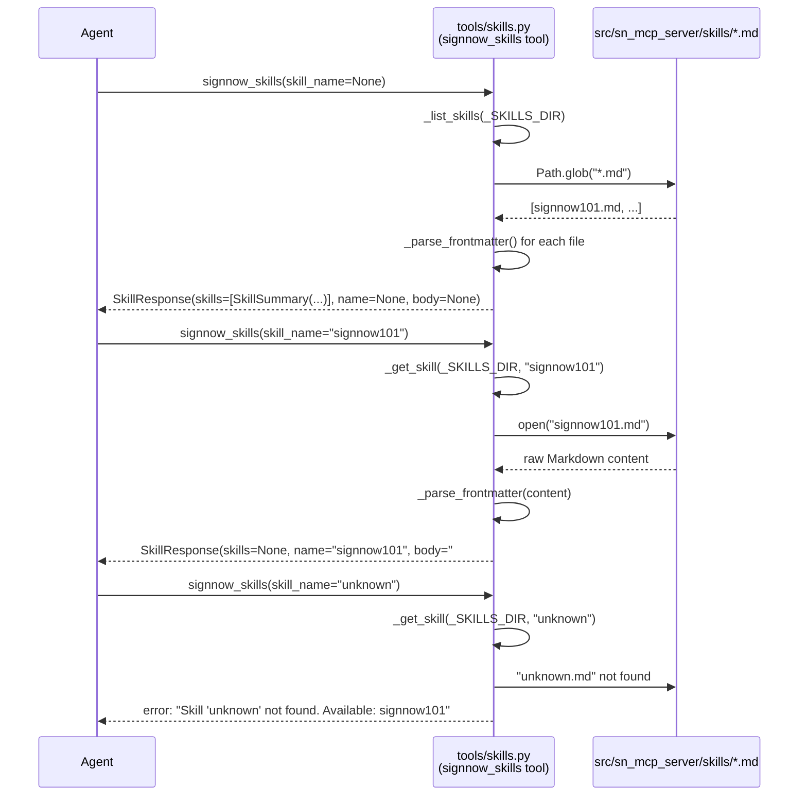

# Spec: SN-30630 — Skills Directory & `signnow_skills` MCP Tool

## 1. Business Goal & Value

AI agents using this server often lack domain knowledge about SignNow entity types, workflow
actions, and which MCP tool maps to which API endpoint. A static skill library — Markdown files
bundled with the server — gives agents a discoverable reference they can query on demand.
The `signnow_skills` tool exposes those files: list all available skills, or fetch the full body
of a named skill. The initial content is `signnow101.md`, a comprehensive SignNow concepts
reference covering entity types, post-upload actions, invite types, and tool → API mappings.

### Philosophy Check ✅

| Principle            | Verdict | Rationale                                                                                                               |
|----------------------|---------|-------------------------------------------------------------------------------------------------------------------------|
| Thin Translator      | ✅       | Reads local Markdown files and returns them verbatim. No transformation logic, no external API calls.                  |
| Stateless            | ✅       | No caching, no in-memory registry. Each call scans `skills/` fresh via `Path.glob`. Skills dir is a read-only constant.|
| Tool Minimization    | ✅       | One new tool handles both listing and fetching via a single optional `skill_name` parameter.                            |
| Token Efficiency     | ✅       | List mode returns only `{name, description}` pairs from front-matter. Full body only when explicitly requested.        |
| YAGNI                | ✅       | Directly required by SN-30630 acceptance criteria. Not speculative.                                                    |
| No Infrastructure Coupling | ✅ | Pure filesystem reads using `pathlib`. No external services, no database, no cloud storage.                            |

---

## 2. Affected Layers

| Layer                  | File(s)                                              | Change Type | Description                                                                     |
|------------------------|------------------------------------------------------|-------------|---------------------------------------------------------------------------------|
| Skills Content         | `src/sn_mcp_server/skills/signnow101.md`            | **New**     | SignNow domain reference: entity types, workflow actions, invite types, tool→API map. |
| Tool Response Models   | `src/sn_mcp_server/tools/models.py`                 | **Modified**| Add `SkillSummary` and `SkillResponse` Pydantic models.                         |
| Tool Business Logic    | `src/sn_mcp_server/tools/skills.py`                 | **New**     | `_list_skills()`, `_get_skill()`, `_parse_frontmatter()`, and `bind()`.         |
| Tool Registration      | `src/sn_mcp_server/tools/__init__.py`               | **Modified**| Import `skills` module and call `skills.bind(mcp, cfg)` inside `register_tools()`. |
| Tests                  | `tests/unit/sn_mcp_server/tools/test_skills.py`     | **New**     | Unit tests for `_list_skills`, `_get_skill`, `_parse_frontmatter`, and staleness. |
| Documentation          | `README.md`                                          | **Modified**| Document `signnow_skills` tool: parameters, modes, example output.              |

> **No `signnow_client` layer changes — and no `signnow.py` changes.** This tool reads local files;
> it makes zero API calls. `SignNowAPIClient` and `TokenProvider` are never involved.
>
> **Registration pattern:** Tools that require `TokenProvider`/`SignNowAPIClient` register inside
> `signnow.py`'s `bind()` closure. Tools with zero API dependency (like `skills`) define their own
> `bind()` in a dedicated module and are registered directly from `__init__.py`. This is the
> designated pattern for infrastructure/utility tools with no auth requirement.

---

## 3. System Diagram (Mermaid)



---

## 4. Technical Architecture

### 4.1 Pydantic Models

Add to `src/sn_mcp_server/tools/models.py`:

```python
class SkillSummary(BaseModel):
    """Name and description of a single bundled skill."""

    name: str = Field(description="Skill identifier (filename without .md extension)")
    description: str = Field(description="One-line description from skill front-matter")


class SkillResponse(BaseModel):
    """Response from the signnow_skills tool.

    Exactly one mode is active per call:
    - List mode (skill_name omitted): `skills` is populated; `name` and `body` are None.
    - Fetch mode (skill_name provided): `name` and `body` are populated; `skills` is None.
    """

    skills: list[SkillSummary] | None = Field(
        default=None,
        description="Available skills with descriptions (list mode only)",
    )
    name: str | None = Field(
        default=None,
        description="Skill identifier (fetch mode only)",
    )
    body: str | None = Field(
        default=None,
        description="Skill content in Markdown, front-matter removed (fetch mode only)",
    )
```

### 4.2 Function Signatures

**`src/sn_mcp_server/tools/skills.py`**

```python
from __future__ import annotations

from pathlib import Path
from typing import Any

from fastmcp import FastMCP

from .models import SkillResponse, SkillSummary

# Resolved once at module load — immutable constant, not mutable state.
# front-matter values are constrained to single-line `key: value` format by convention;
# do not switch to PyYAML without updating the constraint in this spec.
_SKILLS_DIR: Path = Path(__file__).parent.parent / "skills"


def _parse_frontmatter(content: str) -> tuple[dict[str, str], str]:
    """Parse YAML front-matter delimited by --- from Markdown content.

    Args:
        content: Raw Markdown file content.

    Returns:
        Tuple of (frontmatter_dict, body_without_frontmatter).
        If no valid front-matter is found, returns ({}, content).
    """
    ...


def _list_skills(skills_dir: Path) -> SkillResponse:
    """Scan skills_dir for *.md files and return their names and descriptions.

    Each file's front-matter `name` and `description` fields are used.
    If front-matter is missing or malformed, the filename stem is used as name
    and description is left as an empty string (graceful degradation).

    Args:
        skills_dir: Directory to scan for *.md files.

    Returns:
        SkillResponse(skills=[...], name=None, body=None) — list mode.

    Raises:
        ValueError: If skills_dir does not exist.
    """
    ...


def _get_skill(skills_dir: Path, skill_name: str) -> SkillResponse:
    """Read and return the body of a named skill file, front-matter stripped.

    Args:
        skills_dir: Directory containing *.md skill files.
        skill_name: Identifier for the skill (filename without .md extension).

    Returns:
        SkillResponse(skills=None, name=skill_name, body="...") — fetch mode.

    Raises:
        ValueError: If skill_name does not match any file in skills_dir.
                    Error message includes the list of available skill names.
    """
    ...


def bind(mcp: FastMCP, cfg: Any) -> None:
    """Register the signnow_skills tool with the MCP server.

    Args:
        mcp: FastMCP server instance.
        cfg: Server configuration (unused; present for interface consistency).
    """
    ...
```

**Tool registration and function inside `bind()` in `tools/skills.py`:**

```python
from mcp.types import ToolAnnotations

@mcp.tool(
    name="signnow_skills",
    description=(
        "Query the bundled SignNow skill library. "
        "Omit skill_name to list all skills with descriptions. "
        "Provide skill_name to read the full skill body."
    ),
    annotations=ToolAnnotations(
        title="Query SignNow skill library",
        readOnlyHint=True,
        destructiveHint=False,
        idempotentHint=True,
        openWorldHint=False,
    ),
    tags=["skill", "reference"],
)
async def signnow_skills(
    skill_name: Annotated[
        str | None,
        Field(
            default=None,
            description=(
                "Name of the skill to retrieve (e.g. 'signnow101'). "
                "Omit to list all available skills with their descriptions."
            ),
        ),
    ] = None,
) -> SkillResponse:
    """Query the bundled SignNow skill library.

    When called without arguments, returns a list of all available skills
    with their names and one-line descriptions (skills field populated).

    When called with skill_name, returns the full Markdown body of that skill,
    front-matter stripped (name and body fields populated).

    Use signnow101 first if you are unfamiliar with SignNow entity types,
    workflow actions, or which tool to call for a given task.
    """
    ...
```

> **No `TokenProvider` or `SignNowAPIClient` in this `bind()`.** Unlike `signnow.py`'s `bind()`,
> this closure captures nothing — it only references the module-level `_SKILLS_DIR` constant.

### 4.3 Business Logic Flow

**`_parse_frontmatter(content)`**

1. Check if `content` starts with `---\n`; if not, return `({}, content)`.
2. Find the closing `---\n` after the opening delimiter.
3. If not found, return `({}, content)`.
4. Extract the YAML block between the two delimiters.
5. Parse using `re.findall(r'^(\w+)\s*:\s*(.+)$', yaml_block, re.MULTILINE)` (no PyYAML dependency).
6. Return `(dict(matches), remainder_after_closing_delimiter)`.

> **No PyYAML.** Use simple regex line-by-line parsing to avoid an extra dependency.
> Only `name` and `description` fields are consumed; all others are ignored.

---

**`_list_skills(skills_dir)`**

1. If `skills_dir` does not exist → raise `ValueError(f"Skills directory not found: {skills_dir}")`.
2. Collect all `*.md` files via `sorted(skills_dir.glob("*.md"))`.
3. For each file:
   a. Read raw content.
   b. Call `_parse_frontmatter(content)` → `(fm, _body)`.
   c. Build `SkillSummary(name=fm.get("name", file.stem), description=fm.get("description", ""))`.
4. Return `SkillResponse(skills=[...], name=None, body=None)`.

---

**`_get_skill(skills_dir, skill_name)`**

1. Build target path: `skills_dir / f"{skill_name}.md"`.
2. If file does not exist:
   a. Collect available names: `[f.stem for f in sorted(skills_dir.glob("*.md"))]`.
   b. Raise `ValueError(f"Skill '{skill_name}' not found. Available skills: {', '.join(available)}")`.
3. Read file content.
4. Call `_parse_frontmatter(content)` → `(fm, body)`.
5. Return `SkillResponse(skills=None, name=fm.get("name", skill_name), body=body.strip())`.

---

**`bind(mcp, cfg)` / `signnow_skills` tool**

1. `_SKILLS_DIR` is already resolved at module load (immutable `Path` constant).
2. If `skill_name` is `None` → call `_list_skills(_SKILLS_DIR)` → return `SkillResponse` in list mode.
3. Else → call `_get_skill(_SKILLS_DIR, skill_name)` → return `SkillResponse` in fetch mode.
4. Any `ValueError` from business logic propagates naturally as an MCP tool error.

> Note: `cfg` is accepted for interface consistency with the registration pattern but is unused;
> this tool requires no authentication and no config-derived values.

### 4.4 Error Catalog

| Trigger                                 | Exception Class | Message Template                                                                                  |
|-----------------------------------------|-----------------|---------------------------------------------------------------------------------------------------|
| `skills_dir` does not exist on disk     | `ValueError`    | `"Skills directory not found: {skills_dir}"`                                                     |
| `skill_name` does not match any `.md`   | `ValueError`    | `"Skill '{skill_name}' not found. Available skills: {', '.join(available)}"` |
| `skills_dir` is empty (no `.md` files) and `skill_name` requested | `ValueError` | `"Skill '{skill_name}' not found. Available skills: (none)"` |

> **No token errors** — this tool never calls `_get_token_and_client()`.

---

## 5. Implementation Steps

- [ ] **Step 1 — Skills directory:** Create `src/sn_mcp_server/skills/` with a `.gitkeep` (or directly with `signnow101.md`).
- [ ] **Step 2 — `signnow101.md`:** Author the skill file with valid YAML front-matter (`name`, `description`) and body covering:
  - Entity types glossary (Document, Template, Document Group, Template Group)
  - Post-upload action table (sign myself, send freeform, role-based invite, create template, check status, download)
  - Invite types reference (freeform, role-based, embedded, field invite)
  - Tool → API endpoint mapping table
- [ ] **Step 3 — Response models:** Add `SkillSummary` and `SkillResponse` to `tools/models.py`.
- [ ] **Step 4 — Business logic:** Implement `tools/skills.py` with `_parse_frontmatter`, `_list_skills`, `_get_skill`, and `bind`. No `TokenProvider`, no `SignNowAPIClient`.
- [ ] **Step 5 — Registration:** In `tools/__init__.py`, import `skills` and call `skills.bind(mcp, cfg)` inside `register_tools()`. Do **not** modify `signnow.py`.
- [ ] **Step 6 — Unit tests:** Implement `tests/unit/sn_mcp_server/tools/test_skills.py` covering all cases in §6.
- [ ] **Step 7 — README:** Document `signnow_skills` in the tools table with parameter description and both usage modes.

---

## 6. Test Matrix

Tests live in `tests/unit/sn_mcp_server/tools/test_skills.py`.
Use `tmp_path` pytest fixture to create real temp directories with synthetic `.md` files.
**No mocking of `SignNowAPIClient` is needed** — this module has no API client dependency.

| Test Name                                | Input                                                                       | Setup (tmp_path)                                                                                     | Expected Output / Assertion                                                                              |
|------------------------------------------|-----------------------------------------------------------------------------|------------------------------------------------------------------------------------------------------|----------------------------------------------------------------------------------------------------------|
| `test_list_skills_returns_all`           | `_list_skills(skills_dir)` — 2 files present                                | Write `alpha.md` and `beta.md` each with `name`/`description` front-matter                         | `SkillResponse(skills=[...2 items...], name=None, body=None)`; correct `name` and `description` on each `SkillSummary` |
| `test_list_skills_sorted_alphabetically` | `_list_skills(skills_dir)`                                                  | Write `z_skill.md`, `a_skill.md`                                                                    | `skills` list is alphabetically ordered: `a_skill` before `z_skill`                                     |
| `test_list_skills_empty_dir`             | `_list_skills(skills_dir)` — no `.md` files                                 | Create empty dir                                                                                    | `SkillResponse(skills=[], name=None, body=None)`                                                         |
| `test_list_skills_missing_dir`           | `_list_skills(nonexistent_path)`                                            | Do not create dir                                                                                   | Raises `ValueError` containing `"Skills directory not found"`                                           |
| `test_list_skills_degraded_frontmatter`  | `_list_skills(skills_dir)` — file with no front-matter                      | Write `nofm.md` with body-only content, no `---` delimiters                                        | `SkillSummary(name="nofm", description="")` in skills list — graceful degradation                        |
| `test_get_skill_happy_path`              | `_get_skill(skills_dir, "signnow101")`                                      | Write `signnow101.md` with valid front-matter and body `"# Body\ncontent"`                         | `SkillResponse(skills=None, name="signnow101", body="# Body\ncontent")`                                  |
| `test_get_skill_body_is_stripped`        | `_get_skill(skills_dir, "myskill")`                                         | Write `myskill.md` with front-matter and body containing leading/trailing whitespace                | `body` has `.strip()` applied; no leading/trailing newlines                                              |
| `test_get_skill_not_found`              | `_get_skill(skills_dir, "unknown")`                                         | Write `signnow101.md` only                                                                          | Raises `ValueError` containing `"'unknown' not found"` and `"signnow101"` in message                    |
| `test_get_skill_not_found_empty_dir`    | `_get_skill(skills_dir, "anything")`                                        | Empty skills dir                                                                                    | Raises `ValueError` containing `"(none)"` in available list                                             |
| `test_parse_frontmatter_valid`           | `_parse_frontmatter("---\nname: foo\ndescription: bar\n---\nbody")`        | n/a                                                                                                 | Returns `({"name": "foo", "description": "bar"}, "body")`                                               |
| `test_parse_frontmatter_no_delimiters`   | `_parse_frontmatter("just body")`                                           | n/a                                                                                                 | Returns `({}, "just body")`                                                                              |
| `test_parse_frontmatter_unclosed`        | `_parse_frontmatter("---\nname: foo\n")`                                   | n/a                                                                                                 | Returns `({}, "---\nname: foo\n")` — unclosed front-matter treated as no front-matter                   |
| `test_signnow101_tool_names_match_registered` | Read `signnow101.md` Tool→API mapping table; read registered tool names from `signnow.py` and `skills.py` | n/a — real files on disk | Every tool name in the `signnow101.md` mapping table exists as a registered MCP tool. No tool in the table is missing or misspelled. (Staleness guard.) |

---

## 7. Risk Assessment

| Risk                                                      | Impact  | Likelihood | Mitigation                                                                                          |
|-----------------------------------------------------------|---------|------------|-----------------------------------------------------------------------------------------------------|
| `signnow101.md` becomes stale as API/tools evolve         | Medium  | High       | Add `test_signnow101_tool_names_match_registered` (see §6) that reads the mapping table from the real `signnow101.md` and asserts every listed tool name exists as a registered MCP tool. Mechanical guard catches drift on every `pytest` run. |
| Front-matter YAML with multi-line `description:` breaks regex parser | Low | Low | Spec constrains `description` to a single line. Validate in review. |
| Agent reads `signnow101` and calls a tool that doesn't exist yet | Low | Low | Content is authored against existing tools only; no speculative endpoints. |
| Skills dir missing at runtime (e.g., Docker image misconfigured) | Medium | Low | `_list_skills` raises a clear `ValueError`; include `skills/` in Dockerfile `COPY` step validation. |
| Large skill file pushes response over MCP token limit    | Low     | Low        | `signnow101.md` is a human-authored reference; keep under 5,000 words during authoring.            |

---

## 8. File Structure Summary

```
src/
└── sn_mcp_server/
    ├── skills/                          ← NEW directory
    │   └── signnow101.md                ← NEW skill file
    └── tools/
        ├── models.py                    ← MODIFIED: add SkillSummary, SkillResponse
        ├── skills.py                    ← NEW: _parse_frontmatter, _list_skills, _get_skill, bind
        └── __init__.py                  ← MODIFIED: import skills, call skills.bind(mcp, cfg)
        # signnow.py — NOT modified

tests/
└── unit/
    └── sn_mcp_server/
        └── tools/
            └── test_skills.py           ← NEW: 13 unit tests (12 functional + 1 staleness guard)

README.md                                ← MODIFIED: signnow_skills tool documentation
```

---

## Appendix A — `signnow101.md` Content Outline

The file must include the following sections (implementation fills details):

### Front-matter
```yaml
---
name: signnow101
description: SignNow concepts reference: entity types, post-upload actions, invite types, and tool-to-API endpoint mappings.
---
```

### Body Sections

#### 1. Entity Types Glossary

| Entity            | Description                                                                                                        |
|-------------------|--------------------------------------------------------------------------------------------------------------------|
| **Document**      | A single uploaded file (PDF/DOCX). Base unit. Has fields, invites, and a status. Created by upload or from template.|
| **Template**      | A reusable document blueprint with pre-configured roles and fields. Cannot be signed directly — must be cloned.    |
| **Document Group**| An ordered collection of Documents sent as a single invite workflow. Signers progress through documents in sequence.|
| **Template Group**| A reusable blueprint for Document Groups; contains multiple Templates that are cloned together as a batch.         |

#### 2. Post-Upload Action Table

| Goal                        | Tool to Call             | Notes                                                      |
|-----------------------------|--------------------------|-------------------------------------------------------------|
| Sign the document myself     | `create_embedded_editor` | Returns a URL to open the editor in-browser                |
| Send for freeform signing    | `send_invite`            | `invite_type: freeform` — signer places fields themselves  |
| Send for role-based signing  | `send_invite`            | `invite_type: role` — fields pre-configured on document    |
| Create a template from doc   | `create_from_template`   | Use an existing template; or use API directly              |
| Check signing status         | `get_invite_status`      | Returns per-signer status                                  |
| Download signed document     | `get_document_download_link` | Returns a time-limited download URL                    |

#### 3. Invite Types Reference

| Invite Type       | How Fields Are Placed  | Who Configures Fields | Tool                       |
|-------------------|------------------------|-----------------------|----------------------------|
| **Freeform**      | Signer places freely   | Signer                | `send_invite`              |
| **Role-Based**    | Pre-configured on doc  | Sender                | `send_invite`              |
| **Embedded Invite**| Pre-configured        | Sender                | `create_embedded_invite`   |
| **Field Invite**  | Pre-configured         | Sender via template   | `send_invite` (role)       |

#### 4. Tool → API Endpoint Mapping Table

| MCP Tool                        | HTTP Method | SignNow API Endpoint                                |
|---------------------------------|-------------|-----------------------------------------------------|
| `list_documents`                | GET         | `/user/documentsv2`                                 |
| `list_all_templates`            | GET         | `/user/documentsv2` (template filter)               |
| `get_document`                  | GET         | `/document/{id}` or `/documentgroup/{id}`           |
| `get_invite_status`             | GET         | `/document/{id}` or `/documentgroup/{id}`           |
| `send_invite`                   | POST        | `/document/{id}/invite` or `/documentgroup/{id}/invite` |
| `send_invite_reminder`          | POST        | `/document/{id}/email2`                             |
| `create_from_template`          | POST        | `/template/{id}/copy`                               |
| `get_document_download_link`    | GET         | `/document/{id}/download/link`                      |
| `create_embedded_invite`        | POST        | `/document/{id}/embedded-invites`                   |
| `create_embedded_editor`        | POST        | `/document/{id}/embedded-editor`                    |
| `create_embedded_sending`       | POST        | `/document/{id}/embedded-sending`                   |
| `get_signing_link`              | POST        | `/document/{id}/signinglink`                        |
| `signnow_skills`                | —           | (local — no API call)                               |
