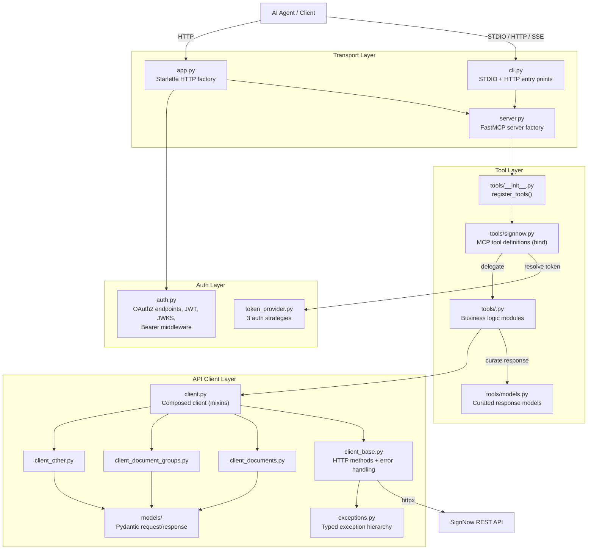
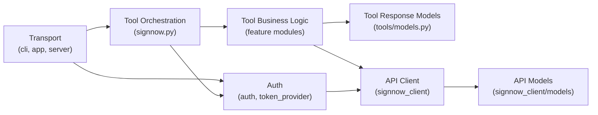
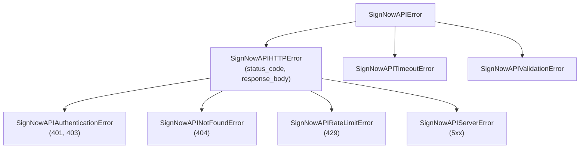

# Architecture blueprint

> Last generated: 2026-04-02
> Generator: architecture-blueprint skill

## Architectural overview

This project follows a **strictly layered architecture** with three tiers: Transport → Tool Layer → API Client. The dependency arrow points strictly downward — `signnow_client` never imports from `sn_mcp_server`.

The server acts as a stateless translation layer: it receives MCP tool calls, resolves authentication, delegates to business logic that calls the SignNow REST API, curates the response through dedicated models, and returns minimal JSON to the agent. No state persists between requests. No database, no cache, no sessions.

The API client uses **mixin composition** — `SignNowAPIClient` inherits from a base HTTP class plus three domain-specific mixins. The tool layer uses a **closure-based registration** pattern where `bind()` captures a `TokenProvider` and defines all tool functions as inner closures.

## System diagram

## Layer structure

| Directory | Layer | Depends on | Must not depend on |
|-----------|-------|------------|--------------------|
| `src/sn_mcp_server/` (root files) | Transport / Bootstrap | `fastmcp`, `starlette`, `typer`, `uvicorn`, `signnow_client` | — (top of stack) |
| `src/sn_mcp_server/auth.py`, `token_provider.py` | Auth | `signnow_client`, `pyjwt`, `cryptography`, config | Tools layer |
| `src/sn_mcp_server/tools/signnow.py` | Tool Orchestration | `tools/<feature>.py`, `tools/models.py`, `token_provider`, `signnow_client` | Transport, auth internals, Starlette |
| `src/sn_mcp_server/tools/<feature>.py` | Tool Business Logic | `signnow_client` (client + models), `tools/models.py` | Other tool modules, transport, auth |
| `src/sn_mcp_server/tools/models.py` | Tool Response Models | `pydantic` | Everything except `pydantic` |
| `src/signnow_client/` | API Client | `httpx`, `pydantic`, `pydantic-settings` | `sn_mcp_server.*` (strictly enforced) |
| `src/signnow_client/models/` | API Data Models | `pydantic` only | Any other module |

### Dependency flow

### Dependency rules

1. **IF editing `src/sn_mcp_server/tools/<feature>.py` (Business Logic):**
   - Allowed: import from `signnow_client`, `tools/models.py`, `tools/utils.py`
   - Forbidden: import from `sn_mcp_server.auth`, `sn_mcp_server.app`, `starlette`, other `tools/<feature>.py` modules

2. **IF editing `src/sn_mcp_server/tools/signnow.py` (Orchestration):**
   - Allowed: import from `tools/<feature>.py`, `tools/models.py`, `token_provider`, `signnow_client`, `fastmcp`
   - Forbidden: import from `sn_mcp_server.app`, `sn_mcp_server.auth` internals

3. **IF editing `src/signnow_client/**` (API Client):**
   - Allowed: import from `httpx`, `pydantic`, own `models/`, own `config.py`, own `exceptions.py`
   - Forbidden: import anything from `sn_mcp_server`

4. **IF editing `src/sn_mcp_server/app.py` or `auth.py` (Transport/Auth):**
   - Allowed: import from `server.py`, `config.py`, `signnow_client`, `starlette`, `fastmcp`
   - Forbidden: import from `tools/` layer directly

## Core components

### FastMCP server (`server.py`)

- **Purpose:** Creates the `FastMCP` instance and triggers tool registration
- **Location:** `src/sn_mcp_server/server.py`
- **Key function:** `create_server()` → instantiates `FastMCP`, calls `register_tools(mcp, cfg)`

### HTTP application (`app.py`)

- **Purpose:** Starlette ASGI app factory, mounts MCP transports and middleware
- **Location:** `src/sn_mcp_server/app.py`
- **Mounts:** `/mcp` (Streamable HTTP), `/sse` (legacy SSE), `/oauth` (OAuth2 endpoints)
- **Middleware stack** (LIFO execution): BearerJWT → TrailingSlash → CORS → App

### Tool orchestration (`tools/signnow.py`)

- **Purpose:** All 16 MCP tool definitions + 6 resource definitions
- **Pattern:** `bind(mcp, cfg)` closure captures `TokenProvider`, defines inner tool functions
- **Each tool:** resolves token → normalizes input → delegates to `tools/<feature>.py` → returns curated model
- **Dual registration:** Read-only tools register both `@mcp.tool()` and `@mcp.resource()` sharing an `_impl()` helper

### Token provider (`token_provider.py`)

- **Purpose:** Resolves access token from three auth strategies per request
- **Resolution order:** config credentials (password grant) → HTTP Bearer header → OAuth2 JWT flow
- **Stateless:** no token caching, password grant fires on every invocation

### API client (`signnow_client/client.py`)

- **Purpose:** Composed HTTP client for SignNow REST API
- **Composition:** `SignNowAPIClient(Base, DocumentMixin, DocumentGroupMixin, OtherMixin)`
- **Base pattern:** `_get()`, `_post()`, `_put()`, `_post_multipart()` with unified error handling
- **HTTP config:** 60s timeout, 10s connect, User-Agent `sn-mcp-server/0.1`

### Response models (`tools/models.py`)

- **Purpose:** Curated Pydantic models that strip, normalize, and flatten API responses
- **Key pattern:** Status normalization (`InviteStatusValues` maps raw → unified), expiration computation, `model_dump()` overrides to exclude conditional fields
- **~40 models**, 790 lines

## Cross-cutting concerns

### Authentication and authorization

Three auth strategies implemented in `src/sn_mcp_server/token_provider.py` and `src/sn_mcp_server/auth.py`:

| Strategy | Trigger | Mechanism | File |
|----------|---------|-----------|------|
| Password grant | `SIGNNOW_EMAIL` + `SIGNNOW_PASSWORD` + `SIGNNOW_BASIC_TOKEN` set | `client.get_tokens_by_password()` on every call | `token_provider.py` |
| Bearer extraction | HTTP `Authorization: Bearer <token>` header | Extract from request headers | `token_provider.py` |
| OAuth2 JWT | `OAUTH_CLIENT_ID` + `OAUTH_CLIENT_SECRET` + RSA key | RS256 JWT verification, JWKS endpoint | `auth.py` |

**Middleware:** `BearerJWTASGIMiddleware` in `auth.py` protects `/mcp`, `/sse`, `/messages` paths. ASGI-level inspection of `Authorization` header. **Bypassed entirely** when config credentials are present (password-grant mode).

**OAuth2 endpoints** mounted at `/oauth/`: authorize, token, register, `.well-known/jwks.json`.

### Error handling

Two-tier exception hierarchy:

**Client layer** (`client_base.py`): catches `httpx` exceptions, maps HTTP status codes to typed exceptions.
**Tool layer**: uses `try/except` ladders for entity type auto-detection. Unhandled exceptions propagate to FastMCP error serialization.

### Validation

- **Tool parameters:** Pydantic `Annotated[..., Field(...)]` with constraints, validated by FastMCP before tool execution
- **API requests:** Pydantic models with `model_dump()` overrides for conditional field exclusion (`redirect_target`)
- **API responses:** `validate_model=Model` parameter in client base methods for Pydantic v2 validation
- **Config:** `pydantic-settings` `BaseSettings` with field validators (silent empty→default conversion)
- **Credential validation:** `SignNowConfig` model_validator enforces oneOf: (email+password+basic_token) OR (client_id+client_secret)

### Configuration management

Two independent `pydantic-settings` classes, both reading `.env` from CWD:

| Class | File | Purpose |
|-------|------|---------|
| `Settings` | `src/sn_mcp_server/config.py` | OAuth issuer, RSA keys, server port, CORS origins |
| `SignNowConfig` | `src/signnow_client/config.py` | API base URL, credentials, app base URL |

Both classes print all config values (masked) to stdout on initialization via `_print_config_values()`.

## Service communication

- **Internal:** No inter-service communication. Single-process, single-service.
- **External:** `SignNowAPIClient` communicates with SignNow REST API via `httpx` (synchronous). All calls go through `client_base.py` methods with unified timeout (60s) and error handling.
- **MCP transports:** Three transports serve the same tool set:
  - **STDIO** — `sn-mcp serve` via Typer CLI
  - **Streamable HTTP** — mounted at `/mcp` via `FastMCP.http_app()`
  - **SSE (legacy)** — mounted at `/sse` via deprecated `create_sse_app`

## Entity type auto-detection

Tools that operate on both documents and document groups use a try/except ladder to detect entity type when not explicitly provided. This results in 1-3 API calls per invocation.

**Detection order varies by tool** (known deviation — see AGENTS.md):

| Tool group | Tries first | Then |
|------------|-------------|------|
| `send_invite`, `embedded_*`, `download_link` | document_group | document |
| `get_document` | document | document_group → template_group |
| `create_from_template` | template_group (list search) | template |

## Testing architecture

| Layer | Test type | Location | Mocking | Coverage |
|-------|-----------|----------|---------|----------|
| Tool models | Unit | `tests/unit/sn_mcp_server/tools/test_expiration.py` | None | Expiration computation |
| Tool logic | Unit | `tests/unit/sn_mcp_server/tools/test_list_*.py` | `MagicMock(SignNowAPIClient)` | Template/document listing |
| Folder models | Unit | `tests/unit/sn_mcp_server/tools/test_folders_lite.py` | None | Discriminated union parsing |
| HTTP middleware | Unit | `tests/unit/sn_mcp_server/test_cors_expose_headers.py` | None | CORS preflight behavior |
| Client imports | Unit | `tests/unit/signnow_client/test_invite_from_alias.py` | None | Re-export validation |
| Tool → client | Integration | `tests/integration/` | `respx` (HTTP layer) | Tool function calls right endpoint, parses response |
| Client method | API | `tests/api/` | `respx` (HTTP layer) | URL, method, headers, response model, error mapping |

**Mocking pattern:** Unit tests use `MagicMock()` for `SignNowAPIClient`, `AsyncMock(spec=Context)` for FastMCP `Context`. Integration and API tests use `respx.mock(base_url=...)` to intercept `httpx` calls — no real SignNow API calls. Both use `SignNowConfig.model_construct()` to construct the client without triggering credential validation.

**JSON fixtures:** `tests/{integration,api}/fixtures/*.json`. Naming: `{http_method}_{resource}__{variant}.json` for success, `error__{description}.json` for error bodies.

**Not tested:** `auth.py`, `token_provider.py`, all write tools (`send_invite`, `create_from_template`, `embedded_*`, `update_document_fields`), entity auto-detection logic. No CI for tests.

## Known deviations

| Location | Intended | Actual | Impact |
|----------|----------|--------|--------|
| `auth.py` module scope | Lazy initialization | Config load + RSA keygen + client creation at import time | High — side effects on import, hard to test |
| `auth.py` `REGISTERED_CLIENTS` | Stateless server | Mutable module-level dict (declared but unused) | Low — dead code, principle violation |
| `tools/signnow.py` `get_http_headers` | Transport-agnostic tools | Imports from `fastmcp.server.dependencies` | Medium — couples orchestration to transport |
| `signing_link.py` | Secure token handling | Access token in URL query string | Medium — security concern |
| `tools/__init__.py` `cfg` param | Config propagation | Accepted but never used in `bind()` | Low — dead parameter |
| Entity detection order | Consistent order across tools | `get_document` tries document first, others try group first | Medium — inconsistent behavior |
| Both `/sse` and `/mcp` | Single transport per endpoint | Legacy and modern transports both active | Low — backwards compat |
| `signnow.py` `upload_document` | Available tool | Fully implemented but commented out | Low — feature gate |
| Pre-commit | Single formatter | Both `ruff-format` and `black` configured | Low — potential conflicts |

---

_This file is the authoritative architectural specification. Implementation agents read it before writing code. Drift from this spec is a bug. Regenerate after significant structural changes._
